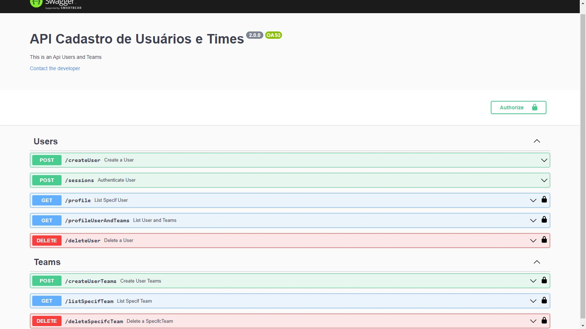

## API de cadastro de Usuários e Times com Banco Postgres.

### 💻 Projeto

- Projeto na versão 2 com integração ao BD postgres.

- Nesta aplicação está sendo feita uma API, que é possível cadastrar `usuário com (username, userAvatar, email e password)`, a aplicação gera um `user_id` único randômico para o usúario, também é possível cadastrar `times de futebol com (nome, cidade e pais)`,a aplicação gera um `team_id` único randômico para o time, desde que exista um `usuário` já cadastrado para poder fazer o cadastro dos times, essa verificação é feita pelo `user_id` do usuário, também é possível listar todos usuários criados, e seus respectivos times cadastrados, deletar usuários e times e etc.
- Após a criação do Usuário, é necessário "Authentica" o mesmo para poder seguir com as outras rotas da aplicação, a autenticação é feita pelo `email` e `password` do usuário cadastrado, gerando assim o `Token`, para esse usuário, o qual é necessário em todas as rotas, exceto a `createUser`, e `/sessions`, obviamente.

## 🚀 Como executar

### Rotas da aplicação `Users`

#### CreateUsers.routes: Post - `/createUser`.

- A rota deve receber `username` , `userAvatar`, `email` e `password` dentro do corpo da requisição. Ao cadastrar um novo usuário, ele deve ser armazenado dentro de um objeto no seguinte formato:

"user_id": "",
"username": "",
"userAvatar": "",
"email": "",
"password"
"created_at": "",

#### AuthenticateUserRoute: Post - `/sessions`.

- A rota deve receber `email` e `password` dentro do corpo da requisição, gerando assim o `Token` ao usuário.

#### listUserRoute: Get - `/profile`.

- A rota deve receber pelo parâmetro de consulta `query` o `user_id` do usuário a ser consultado , e o `Token` do usuário pelo `auth`, essa consulta só pode acontecer caso os dois parâmetros passados anteriormente sejam válidados. 

#### listUserAndTeamsRoute: Get - `/profileUserAndTeams`.

- A rota deve receber pelo parâmetro de consulta `query` o `user_id` do usuário a ser consultado , e o `Token` do usuário pelo `auth`, essa consulta só pode acontecer caso os dois parâmetros passados anteriormente sejam válidados.

#### deleteUserRoute: Delete - `/deleteUser`.

- A rota deve receber pelo parâmetro de consulta `query` o `user_id` do usuário a ser deletado , e o `Token` do usuário pelo `auth`, essa rota só pode concluir a exclusão com sucesso, caso os dois parâmetros passados anteriormente sejam válidados.

### Rotas da aplicação `Teams`

#### createUserTeamsRoute: Post = `/createUserTeams`.

- A rota deve receber `teamName`, `city` e `country` dentro do corpo da requisição, a propriedade `user_id` contendo o `id` do usuário, é passado automáticamente pelo `request.user`, e o `Token` do usuário pelo `auth`, Ao criar um novo Time, ele deve ser armazenado dentro do array `teams` do usuário que está cadastrando esse time, Certifique-se que o ID seja um UUID, cada time deverá estar no seguinte formato:

"team_id": "",
"user_id": "",
"teamName": "",
"city": "",
"country": "",
"created_at": ""

#### listSpecifcTeamRoute: Get = `/listSpecifcTeam`.

- A rota deve receber pelo parâmetro de consulta `query` o `team_id` do time a ser consultado , e o `Token` do usuário pelo `auth`, essa consulta só pode acontecer caso os dois parâmetros passados anteriormente sejam válidados.

#### deleteSpecifcTeamRoute: Delete = `/deleteSpecifcTeam`.

- A rota deve receber pelo parâmetro de consulta `query` o `team_id` do time a ser deletado, e o `Token` do usuário pelo `auth`, essa rota só pode concluir a exclusão com sucesso, caso os dois parâmetros passados anteriormente sejam válidados.

## Para rodar essa aplicação siga os seguintes passos:

- Copie a url do repositório na aba `CODE`.
- Com o git instalado, execute o seguinte comando => `git clone "Aqui vai a url copiada acima`.
- Com o `Nodejs` e o `Yarn` instalados, Na sua IDE preferida, abra o terminal do `git`, e execute o seguinte comando => `yarn`, para baixar as dependências da aplicação.
- Para rodar o projeto execute o seguinte comando => `yarn dev`.
- Para testar o funcional da aplicação será necessário instalar o software `Insomnia` e criar as rotas da aplicação citadas acima.

## Para rodar os testes integrados das rotas da aplicação siga os seguintes passos:

-  Será necessário criar um banco de dados somente para os testes da aplicação, banco no qual chamei de `dbtest`, os testes integrados necessitam desse banco para o funcionamento, após isso ....
- Para rodar os testes integrados das rotas da aplicação execute o seguinte comando => `yarn test`.

## Para rodar a Documentação da Aplicação

- Com a aplicação já startada ... No seu navegador de internet digite => `http://localhost:8080/api-doc`